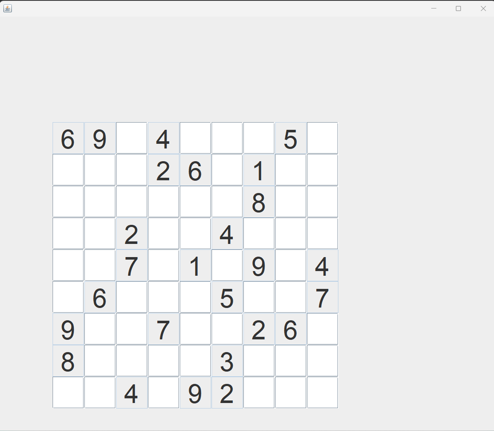
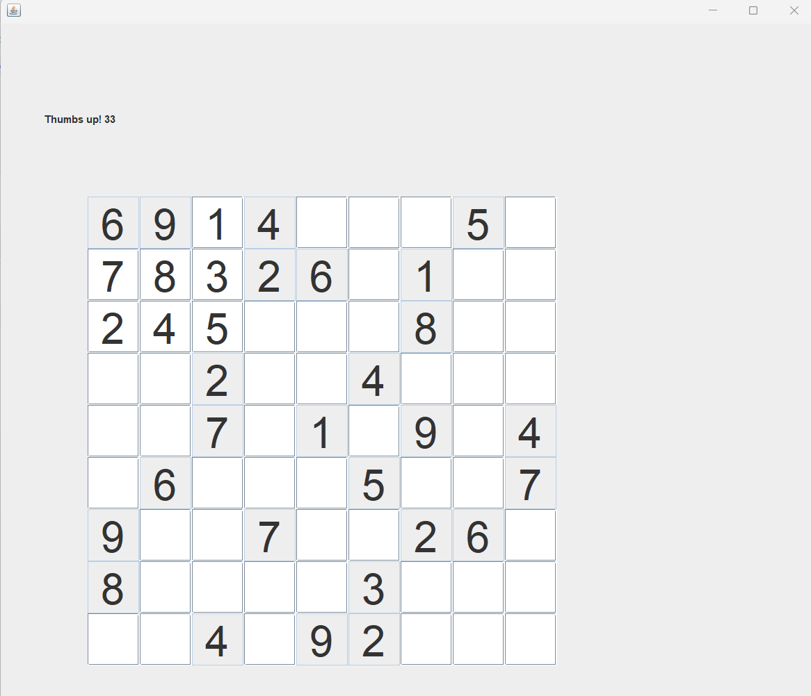
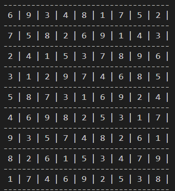

# Interactive_Sudoku
- Generates an interactive sudoku that contains exactly one solution. User can solve the sudoku by entering the appropriate digits.
- Interactive window is created using **Java Swings**

## Unsolved sudoku

## Partially solved

## Solution

